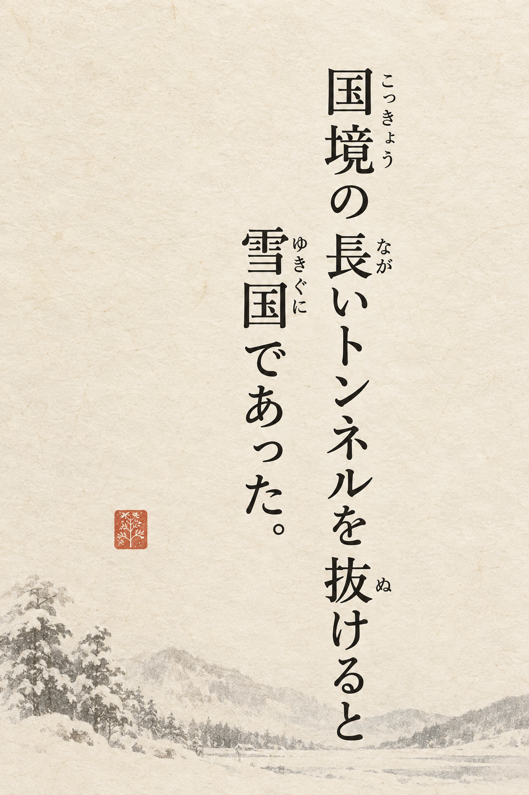
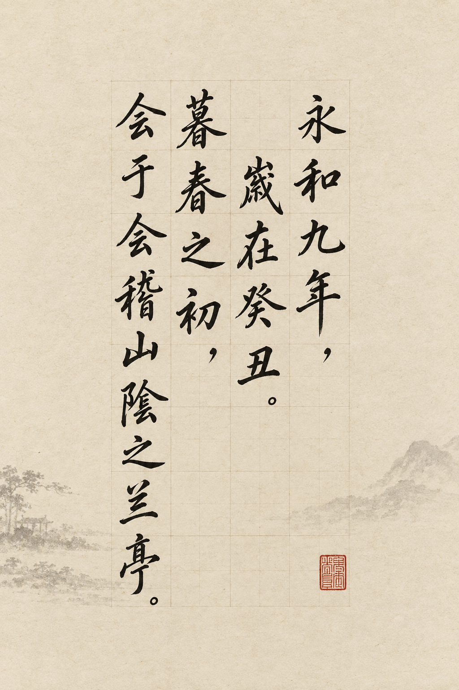

# YEYOU: field research and product direction

**Research date:** 2026-09-11  
**Scope:** Japanese furigana/layout tools, Chinese copybook/calligraphy tools, and current generative-image workflows. This is a directional scan, not an exhaustive census or a controlled usability study.

## Executive conclusion

There is a real opening, but it is not “another furigana generator” and not “another 田字格 worksheet maker.” Both of those categories are already crowded.

The stronger product idea is a **multilingual literary typesetting studio**: turn a passage into a culturally appropriate, beautiful, editable and exportable reading/copy poster. Its promise should be:

> AI taste, typesetting certainty.

Use a deterministic layout engine for every character, reading, variant, punctuation mark and exported page. Use generative AI for art direction, paper/background textures, palette and composition suggestions—not as the final text renderer.

The quick scan found **at least 18 directly relevant products**: eight in or adjacent to Japanese furigana and ten in Chinese copybook/calligraphy. That is a lower-bound sample, not a claim about the total market. The Japanese products concentrate on accessibility and reading; the Chinese products concentrate on printable practice. The under-served intersection is **literary content × refined visual composition × reliable CJK text × reversible editing**.

## 1. What the current project is

The repository is a useful proof of concept:

- Plain HTML/CSS/JavaScript with no build step.
- An 8.5 MB local dictionary with 184,791 keys, derived from JMdict/Kanjidic2.
- Vertical/horizontal modes, multiple palettes, font and ruby controls, aspect ratios, URL-persisted appearance, and click-to-change readings.
- A direct DOM preview using semantic `<ruby>` / `<rt>` markup.

It is closer to an interactive typesetting experiment than a finished poster tool. That is a good foundation: semantic text remains editable and selectable, unlike an image-only workflow.

### Current quality risks

1. **Context is not modeled.** The renderer groups adjacent scripts, then uses the first dictionary reading. It does not perform robust morphological or contextual analysis. Ambiguous forms such as `今日`, `人気`, names, ateji, contractions and inflections will fail unpredictably.
2. **The showcase itself is not trustworthy.** The static HTML gives `白` the reading `ひろ`, rather than `しろ` in `白く`, and the `汽車` ruby markup is malformed. The dictionary contains `白 → しろ` and `汽車 → きしゃ`; these errors are in the hand-written initial markup.
3. **Okurigana editing is fragile.** The stored reading for an okurigana group is already shortened, while the selection handler shortens it again.
4. **Text is interpolated into `innerHTML` without escaping.** Pasted markup can become executable HTML. The next architecture should use a structured document model and DOM nodes, not string concatenation.
5. **There is no production export path.** A poster product needs deterministic PNG/SVG/PDF export, print dimensions, embedded fonts, bleed/margins and a “what you see is what you export” contract.
6. **Style state is shareable; content state is not fully authored as a document.** There is no project model, undo/redo, saved variants, content validation or provenance for manual reading corrections.

## 2. Competitive landscape

### A. Japanese: furigana, accessibility and document workflows

| Product | Primary job | Strongest capability | Weakness relative to this opportunity |
|---|---|---|---|
| [ふりがなメーカー](https://furigana.e-edu.jp/) | Add and edit ruby in existing files | Preserves file format; manual correction; vertical/horizontal alignment; saved custom readings | Utility/editor workflow, not expressive poster design |
| [ルビ振り先生](https://rubifuri.jp/) | Prepare school Word/PDF handouts | Local processing, Word/PDF support, grade-aware/first-occurrence controls, vertical recognition | Education-document workflow; limited art direction |
| [siutil Furigana](https://siutil.com/furigana/) | Paste text and obtain ruby | Browser-local Kuromoji/IPADIC analysis; handles okurigana; copies HTML or plain notation | Clean converter, not a layout studio |
| [digtools Vertical Editor](https://tools.digrart.jp/en/vertical-editor/) | Vertical manuscript layout | Vertical composition and vector-oriented manuscript-paper PDF | Narrow template family; weaker language intelligence |
| [Rubyful Button](https://rubizaidan.jp/rubyful-button/) | Make websites more readable | One-line website integration and ruby toggle | Website accessibility component, not content creation |
| [Yukari Rubi](https://github.com/f3liz-casa/yukari-rubi) | Add ruby to any webpage | Browser-local Sudachi/WASM, live page updates, user dictionary | Reader extension rather than authoring/export |
| [Furigana Maker extension](https://github.com/aiktb/furiganamaker) | Add furigana on webpages | Hiragana/katakana/romaji and hover modes | Broad reading aid; not high-fidelity composition |
| [Jenee Ruby Generator](https://jenee.jp/en/ruby-generator) | Generate HTML ruby tags | Simple explicit base/reading pairs and CSS hooks | Manual annotation; no automatic language/layout system |

**Assessment.** Automatic ruby is already a commodity feature. The strongest competitors solve correction, privacy, file compatibility or reading-level filtering. A new product needs to win on the complete object being made—the poster/page—not merely on the presence of ruby.

### B. Chinese: worksheets, copybooks and historical calligraphy

| Product | Primary job | Strongest capability | Weakness relative to this opportunity |
|---|---|---|---|
| [字帖网](https://zitie5.com/) | Browser worksheet generator | Grid/font/content controls plus PDF, image and print output | Dense utility UI and school-first aesthetic |
| [快乐练字](https://221568.com/help.html) | Printable practice sheets | Five tracing/practice modes, pinyin, vertical text, multi-page local export | Optimized for drills rather than collectible literary design |
| [字帖大师](https://sogou.wxlet.cn/index.html) | Highly configurable copybooks | Live preview, pinyin tasks, poem layouts, vertical “古风” formats | Configuration-heavy; visual identity is template-led |
| [学于趣字帖](https://zitie.xueyuqu.com/) | Primary-school and poetry sheets | Textbook corpus, font choices, vertical poetry | Content-rich but visually conventional |
| [硬笔书法](https://apps.apple.com/cn/app/%E7%A1%AC%E7%AC%94%E4%B9%A6%E6%B3%95-%E5%AD%97%E5%B8%96%E7%94%9F%E6%88%90%E5%99%A8/id6502593031) | Offline iOS/iPad copybooks | Five grid systems, pinyin correction, project/templates, A4/A5/B5/Letter PDF | Strong production utility; limited historical-source storytelling |
| [巨峰字帖](https://apps.apple.com/cn/app/%E5%B7%A8%E5%B3%B0%E5%AD%97%E5%B8%96-%E5%B0%8F%E5%AD%A6%E7%94%9F%E7%BB%83%E5%AD%97%E4%B9%A6%E6%B3%95%E4%B8%B4%E6%91%B9%E5%AD%97%E5%B8%96%E7%94%9F%E6%88%90/id1542220032) | Mobile calligraphy practice | Many templates/fonts, stroke order, custom font import, PDF and S/T conversion | Broad but school/practice-oriented; app-store surface reports 4.3/5 from 450 ratings at research time |
| [ChineseHandCopy](https://apps.apple.com/us/app/chinesehandcopy/id613212406) | Immersive digital tracing | Imported fonts, tracing, paper/ink themes, high-resolution image and PDF export | More practice surface than literary publishing tool |
| [Copyworks](https://play.google.com/store/apps/details?id=com.loqu8.copyworks) | Chinese learner worksheets | Model → trace → blank progression, tone colors, stroke order and pronunciation annotations | Language-learning worksheet rather than calligraphic composition |
| [书法集帖下载](https://www.xmcase.cn/) | Copybook and personal-font production | Handwriting-to-TTF workflow plus print layout | Production-oriented and complex; not a lightweight creative tool |
| [书法AI](https://dtstars.com/) | AI coaching, copybooks and 碑帖集字 | Five-dimension critique; source-aware historical glyph selection; missing-glyph disclosure | The closest strategic competitor; broader coaching app and likely heavier workflow |

**Assessment.** Chinese worksheet generators compete on checklists: grid type, tracing mode, pinyin, stroke order, fonts and PDF. The more interesting adjacent category is **碑帖集字**: selecting authentic glyph images from a coherent historical source, disclosing missing characters and composing a new work. That is differentiated, but it introduces provenance, font/image licensing and source-consistency problems.

### Heuristic capability comparison

Scores are directional (1 weak, 5 strong), based on public product descriptions and visible product surfaces—not a controlled hands-on test.

| Product type | Reading/character certainty | Expressive design | Manual correction | Print/export | Historical authenticity |
|---|---:|---:|---:|---:|---:|
| Japanese ruby converters | 4 | 1–2 | 3–5 | 2–4 | 1 |
| Japanese vertical editors | 2–3 | 3 | 3 | 4–5 | 2 |
| Chinese school copybook generators | 3–4 | 2–3 | 3 | 4–5 | 1–2 |
| Chinese 碑帖集字 products | 3 | 4 | 4 | 4 | 4–5 |
| General AIGC image apps | 1–3 | 5 | 2–4 through iteration | 3 | 2–4 visually, low provenance |
| Proposed hybrid product | **5 target** | **5 target** | **5 target** | **5 target** | 3 initially; 5 with sourced glyphs |

## 3. Live AIGC benchmark

Two posters were generated in this research session with ChatGPT image generation. Both prompts explicitly required exact text, vertical right-to-left composition, and no extra text.

### Japanese test

Input:

> 国境の長いトンネルを抜けると雪国であった。

Required mappings: `国境=こっきょう`, `長=なが`, `抜=ぬ`, `雪国=ゆきぐに`.



**Observed result:** excellent art direction and a surprisingly successful single sample: the main string and requested readings are visibly preserved, the columns follow traditional order, and the hierarchy is attractive. It is immediately useful as a moodboard or editable design reference.

**But:** one successful render is not a typesetting guarantee. Small ruby text is especially hard to proof visually, character positions are not addressable as structured text, and corrections require regeneration or compositing.

### Chinese test

Input:

> 永和九年，岁在癸丑。暮春之初，会于会稽山阴之兰亭。

The prompt explicitly required simplified Chinese exactly as supplied.



**Observed result:** the composition, ink texture, seal and practice-grid treatment are strong. However, the image silently converts at least `岁`, `阴` and `兰` to `歲`, `陰` and `蘭`. In other words, the model inferred “classical calligraphy” as a traditional-script style and overrode an explicit content constraint.

This is the decisive finding. Generative image models can supply taste and speed, but script variant is data, not decoration. OpenAI itself advises keeping image text specific and considering design-tool polishing for dense layouts; Google likewise says image text works best under 25 characters and may require regeneration ([OpenAI guidance](https://openai.com/academy/image-generation/), [Google Imagen guidance](https://ai.google.dev/gemini-api/docs/imagen)).

### What the AIGC product should do

1. Generate a **design recipe**, not a flattened final poster: palette, margins, paper texture, seal position, type scale and reference mood.
2. Render the supplied text afterward using deterministic browser/SVG/PDF typography.
3. Lock every glyph to an explicit locale/script policy: `ja-JP`, `zh-Hans-CN`, `zh-Hant-TW`, `zh-Hant-HK`.
4. Run programmatic checks before export: exact character sequence, ruby mapping, forbidden S/T substitutions, line/column overflow and missing font glyphs.
5. Optionally generate a text-free background and place real text over it. Never ask the image model to paint the production copy.

## 4. Product position and UI language

### Recommended position

**“Make a page worth keeping from words worth copying.”**

The emotional product is closer to a small press, stationery studio or literary museum shop than to a language utility. Learning features can remain, but the output should feel desirable even to a fluent reader.

Three creation modes can share one engine:

1. **Read** — Japanese ruby, Chinese pinyin/zhuyin, selective annotation by level or first occurrence.
2. **Copy** — 原稿用紙, 田字格, 米字格, 描红, model/trace/blank sequences, stroke-order overlays.
3. **Compose** — vertical literary posters, poem cards, title inscriptions, colophons, seals and historically informed presets.

### UI recommendation

Use **shadcn/Radix-style primitives for the editor shell**, but create a distinct visual language for the work surface.

- Shell: accessible menus, popovers, sliders, tabs, command palette, dialogs and responsive panels. This is where a component library saves time.
- Canvas: custom “paper,” “ink,” “annotation,” “grid,” “seal” and “colophon” primitives. This is the product identity and should not look like a generic dashboard.
- Interaction model: content on the left, live page in the center, a compact inspector on the right; on mobile, page-first with a bottom sheet.
- Replace dozens of always-visible inputs with meaningful presets plus a smaller “fine tune” inspector.
- Every AI suggestion should be reversible and inspectable as ordinary settings.

Suggested design tokens should be semantic rather than trend-themed: `paper`, `ink`, `cinnabar`, `faint-rule`, `annotation`, `aged-edge`, `night-paper`. “Tokyo Night” can be a preset; it should not define the system.

## 5. Technical direction

### Separate the engine from the UI

Create a pure TypeScript document model:

```text
Document
  locale + script policy
  blocks[]
    text runs[]
      source text
      annotations[] (ruby / pinyin / zhuyin / gloss)
      manual override + provenance
  layout recipe
  export settings
```

The same model should drive interactive HTML, SVG, PNG and PDF. Do not let rendered HTML become the source of truth.

### Japanese language layer

- Replace longest-string/first-reading lookup with morphological analysis. Kuromoji exposes segmentation and readings; Sudachi provides a reading form and better modern tokenization options ([Kuromoji](https://github.com/atilika/kuromoji), [Sudachi API](https://javadoc.io/static/com.worksap.nlp/sudachi/0.5.2/com/worksap/nlp/sudachi/Morpheme.html)).
- Keep JMdict as a candidate/override source, not as the whole disambiguation strategy.
- Preserve per-token confidence and allow one-click correction.
- Add an explicit user dictionary for names, 義訓/熟字訓, literary readings and project-specific choices.
- Implement ruby placement against the W3C Japanese layout work, which includes dedicated simple-ruby rules ([W3C JLReq tools](https://www.w3.org/groups/tf/i18n-jlreq/tools/)).

### Chinese language layer

- Require a script/region choice and never silently normalize it.
- Use phrase-aware S/T conversion only when the user asks. OpenCC distinguishes character, phrase, regional and Japanese-shinjitai conversions and is Apache-2.0 licensed ([OpenCC](https://github.com/BYVoid/OpenCC)).
- Treat polyphonic pinyin like Japanese ambiguous readings: suggest, expose uncertainty, allow correction and save overrides.
- For practice mode, Hanzi Writer provides programmable stroke animation; validate its underlying data/license requirements before bundling ([Hanzi Writer docs](https://hanziwriter.org/cn/docs.html)).
- Implement vertical punctuation and region-specific layout from W3C CLReq. Chinese punctuation occupies square frames and placement differs between Mainland China and Taiwan/Hong Kong ([W3C CLReq](https://www.w3.org/TR/clreq/)).
- Separate **font-mode calligraphy** from **sourced-glyph 集字**. The latter must retain source work, calligrapher, glyph crop and license/provenance.

## 6. What to build next

### Phase 0 — benchmark before rewrite (1 week)

Create a permanent corpus of 50–100 cases:

- Japanese: compounds, inflections, okurigana, counters, dates, names, ateji, katakana, punctuation, vertical Latin/numerals, ambiguous forms such as `今日`, `人気`, `一日`, `明日`, `日本橋`.
- Chinese: simplified/traditional pairs, polyphones, erhua/neutral tone if supported, vertical punctuation, poetry line breaks, rare characters, variant glyph coverage.
- Assertions: exact base text, annotation, token boundaries, script policy and export checksum/visual snapshots.

Fix the current showcase and unsafe HTML path immediately; they undermine confidence in every later design decision.

### Phase 1 — a lovable Japanese poster MVP (3–5 weeks)

1. Structured document model and undo/redo.
2. Context-aware Japanese readings with visible confidence and overrides.
3. Three excellent templates only: literary vertical, 原稿用紙, modern editorial card.
4. Reliable PNG and print-PDF export with embedded/openly licensed fonts.
5. Shareable project state and reusable presets.
6. Responsive editor shell using component primitives, with a custom paper/canvas language.

### Phase 2 — Chinese foundation (3–5 weeks)

1. `zh-Hans-CN`, `zh-Hant-TW`, `zh-Hant-HK` document policies.
2. Deterministic vertical/horizontal composition and region-correct punctuation.
3. Pinyin off/on/selective plus per-word correction.
4. 田字格 / 米字格 / 描红 and one poetry-poster template.
5. Font coverage and license audit; explicit missing-glyph warnings.

### Phase 3 — AI art director and provenance (later)

1. Natural-language “make it quieter / more Song-dynasty album-like / suitable for A4” mapped into deterministic settings.
2. Text-free generated paper, ink wash and ornament layers.
3. Style extraction from an uploaded reference into a reversible recipe.
4. A licensed, source-attributed historical glyph corpus for 碑帖集字.
5. Visual critique that discusses spacing, balance and hierarchy without modifying the text silently.

## 7. Decision gates

Before investing heavily, test these three hypotheses with five to eight users in each target group:

1. **Japanese learners/teachers:** will they choose a beautiful export over a plain but highly accurate handout, and which correction controls are essential?
2. **Literary/stationery users:** will they make and share posters even without “learning” features?
3. **Chinese calligraphy users:** do they want ordinary font-based layouts, authentic 集字, or both—and how important is source provenance?

Track time-to-first-good-export, number of manual reading corrections, export rate, template changes before export, and whether users can identify the active script/region policy.

## Final recommendation

Do not begin with a broad redesign or a large Chinese feature set. First make the Japanese flow **trustworthy, exportable and unmistakably beautiful**, backed by a benchmark corpus. In parallel, prototype one Chinese poem/poster template with strict script locking. If that prototype excites users, the underlying multilingual document model will support the larger vision without turning the codebase into a set of language-specific exceptions.
